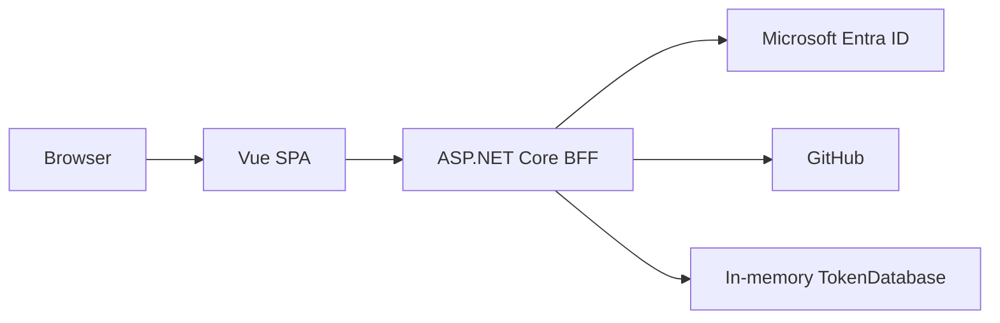
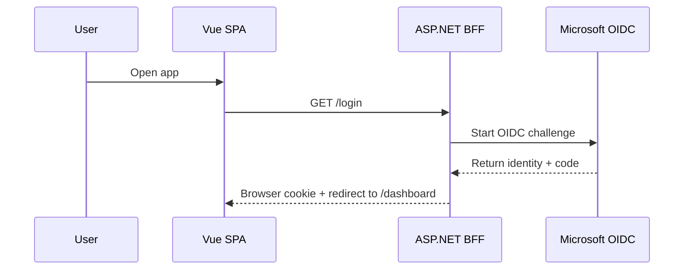

# DashApp

DashApp is a small authentication-oriented sample application that combines a Vue 3 single-page application with an ASP.NET Core backend-for-frontend (BFF). The current implementation uses the BFF as the browser-facing entry point for sign-in, provider linking, and token handling. The Vue app is intentionally thin: it renders the UI, calls the BFF over same-origin HTTP, and never receives provider access tokens directly.

## Architecture overview

The solution is split into two runtime projects:

- [src/Frontend](src/Frontend) contains the Vue application and its Vite build setup.
- [src/BFF](src/BFF) contains the ASP.NET Core host, authentication middleware, endpoints, and token handling.

The browser talks to the SPA first. The SPA then calls the BFF through same-origin routes such as `/api/session` and `/api/dashboard`. The BFF owns the browser session, manages OAuth state, and keeps provider tokens server-side.



## Solution structure

- [src/BFF/Program.cs](src/BFF/Program.cs) wires authentication, endpoint mapping, and the development reverse proxy.
- [src/BFF/Endpoints](src/BFF/Endpoints) contains the route groups for login, connection, and dashboard APIs.
- [src/BFF/Auth](src/BFF/Auth) contains cookie/OpenID Connect/OAuth integration and claims transformation.
- [src/BFF/Data](src/BFF/Data) contains the token storage abstraction and the current in-memory implementation.
- [src/Frontend/src](src/Frontend/src) contains the Vue app, router, views, API helpers, and styles.

## Authentication flow

The current flow is deliberately simple:

1. The user opens the Vue app.
2. The SPA redirects to `/login` on the BFF.
3. The BFF starts an OpenID Connect challenge against Microsoft and creates a cookie-based session for the browser.
4. If the user later connects GitHub, the BFF initiates a GitHub OAuth challenge from the authenticated browser session and stores the resulting access token server-side.
5. The SPA reads the current session and dashboard state from the BFF, but never receives the provider token directly.



## Frontend, BFF, and reverse proxy interaction

During development, the BFF is the entry point for both the SPA and its API calls. The BFF can also act as a reverse proxy to the Vite dev server. In [src/BFF/appsettings.Development.json](src/BFF/appsettings.Development.json), YARP forwards non-API requests to `http://localhost:5173`, which is where Vite serves the Vue app.

That arrangement is useful because it allows the developer to run the frontend and BFF in a single browser-facing origin while still keeping the backend auth logic centralized.

## Development setup

### BFF

From [src/BFF](src/BFF):

```powershell
dotnet restore
dotnet run
```

The BFF runs on HTTPS at `https://localhost:5000` by default through [src/BFF/Properties/launchSettings.json](src/BFF/Properties/launchSettings.json).

### Frontend

From [src/Frontend](src/Frontend):

```powershell
npm install
npm run dev
```

Vite serves the SPA on `http://localhost:5173` by default.

### Configuration

The BFF reads provider credentials from configuration. In the current implementation, the required values are:

- `Microsoft:ClientId`
- `Microsoft:ClientSecret`
- `Github:ClientId`
- `Github:ClientSecret`

These values should be supplied through user secrets or environment variables during local development. The repository-level [/.gitignore](.gitignore) excludes local environment and app settings variants that are not meant to be committed.

## Future direction

The codebase is already structured around the idea that the BFF should remain the browser-facing authentication boundary, but the next natural step is to split the actual business API into a separate backend service. In that future shape, the BFF would continue to own cookies and user-facing authentication, while the API service would expose domain behavior independently.

For the current implementation, see the project-specific documentation:

- [src/BFF/README.md](src/BFF/README.md)
- [src/Frontend/README.md](src/Frontend/README.md)
