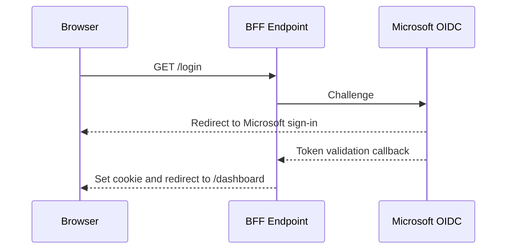
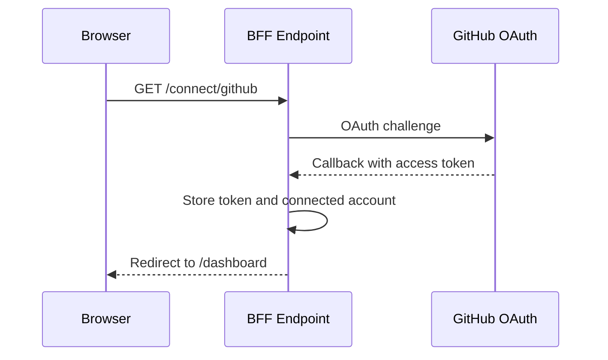
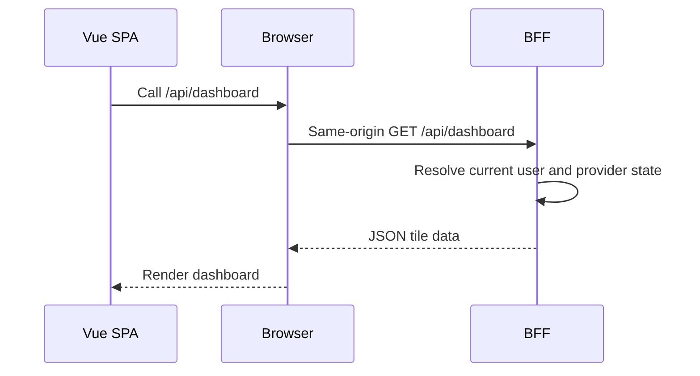
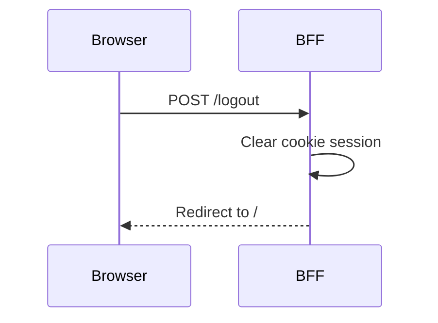

# BFF

## Overview

The BFF is the browser-facing authentication boundary for DashApp. Its purpose is to keep the SPA simple and to ensure that provider OAuth tokens are handled on the server rather than exposed to the browser.

In the current implementation, the BFF is responsible for:

- hosting the cookie-based browser session
- starting Microsoft OpenID Connect sign-in
- starting GitHub OAuth flows for provider connection
- storing provider tokens and connected account metadata server-side
- serving the dashboard and session APIs that the Vue app consumes

The BFF does not expose a general-purpose business API yet. It is not intended to be a full domain backend; it mainly exists to protect and coordinate authentication and provider access.

## Architecture

### Folder structure

- [Program.cs](Program.cs) wires up authentication, endpoints, and the development reverse proxy.
- [Routes.cs](Routes.cs) centralizes route constants used throughout the BFF.
- [Endpoints](Endpoints) contains endpoint definitions for login, connection, and dashboard APIs.
- [Auth](Auth) contains authentication extension methods and claims transformation.
- [Data](Data) contains token storage abstractions and the in-memory database.
- [Properties/launchSettings.json](Properties/launchSettings.json) defines the local HTTPS launch profile.

### Endpoint organization

The BFF currently exposes three route groups:

- login-related routes from [Endpoints/LoginEndpoints.cs](Endpoints/LoginEndpoints.cs)
- provider connect/unlink routes from [Endpoints/ConnectEndpoints.cs](Endpoints/ConnectEndpoints.cs)
- dashboard/session routes from [Endpoints/DashboardEndpoints.cs](Endpoints/DashboardEndpoints.cs)

### Authentication providers

The BFF currently integrates with:

- Microsoft Entra ID through OpenID Connect
- GitHub through OAuth

### Reverse proxy

In development, the BFF can act as a reverse proxy for the Vue app through YARP. The configuration is loaded from [appsettings.Development.json](appsettings.Development.json) and maps requests to `http://localhost:5173`.

### Token storage

Provider tokens are stored in [Data/TokenDatabase.cs](Data/TokenDatabase.cs). The current implementation is in-memory and is registered as a singleton in the dependency injection container.

### Route constants

Shared route values are centralized in [Routes.cs](Routes.cs):

- `/login`
- `/logout`
- `/dashboard`
- `/api/dashboard`
- `/api/session`
- `/connect/{provider}`
- `/unlink/{provider}`
- `/oauth/github-cb`

## Authentication

### Cookie authentication

The BFF uses cookie authentication as the browser session mechanism. The default scheme is configured in [Auth/Providers/Microsoft/MicrosoftAuthExtension.cs](Auth/Providers/Microsoft/MicrosoftAuthExtension.cs) through `AddCookie`.

This is the reason the SPA can remain stateless from the perspective of the server: the browser carries an authentication cookie, and the BFF can resolve the current user on each request.

### OpenID Connect authentication

The Microsoft sign-in flow uses OpenID Connect with the `OpenIdConnectDefaults.AuthenticationScheme` scheme. The BFF requests `openid`, `profile`, `email`, and `offline_access` from Microsoft and stores the resulting access token in the server-side token database.

### OAuth providers

GitHub is integrated through `AddOAuth("github", ...)` in [Auth/Providers/Github/GithubAuthExtensions.cs](Auth/Providers/Github/GithubAuthExtensions.cs). The current implementation only supports the `github` provider for connection flows.

### Authentication schemes used

The BFF uses the following schemes:

- `Cookies` for the browser session
- `OpenIdConnect` for Microsoft sign-in
- `OAuth` for GitHub provider connection

### Claims transformation

Two claims transformers exist:

- [Auth/Providers/Microsoft/MicrosoftClaimsTransformation.cs](Auth/Providers/Microsoft/MicrosoftClaimsTransformation.cs)
- [Auth/Providers/Github/GithubClaimsTransformation.cs](Auth/Providers/Github/GithubClaimsTransformation.cs)

These add claims such as `microsoft-connected` or `github-connected` when the corresponding provider token exists in the database. The claims are used to drive authorization behavior without exposing token information to the SPA.

### Login flow

The login route in [Endpoints/LoginEndpoints.cs](Endpoints/LoginEndpoints.cs) issues a challenge using the OpenID Connect authentication scheme. The redirect target is either `/dashboard` or a supplied `returnUrl`.

### Logout flow

The logout route signs the user out of both the cookie scheme and the OpenID Connect scheme. The redirect target is `/`.

### Provider connection flow

The connect route in [Endpoints/ConnectEndpoints.cs](Endpoints/ConnectEndpoints.cs) starts a provider-specific challenge. The current implementation accepts only the `github` provider.

### Token persistence

Tokens are persisted in [Data/TokenDatabase.cs](Data/TokenDatabase.cs). The values are protected with ASP.NET Core data protection before being stored in memory. The connected account name is stored separately so the dashboard can display the provider account used for the link.

### Why cookies are used

Cookies are used because the SPA is not meant to own the authenticated session. The BFF is the place where the browser session can be validated and where the provider tokens can be kept under server-side control.

### Why provider access tokens are not stored in cookies

The provider tokens are not placed in cookies because the browser should not have direct access to them. Keeping them in the BFF avoids exposing them to JavaScript and keeps the SPA from becoming a token store.

## Development configuration

### YARP configuration

The reverse proxy is configured in [appsettings.Development.json](appsettings.Development.json). The `vite` route forwards requests to the Vite development server on `http://localhost:5173`.

### Development reverse proxy

When the app runs in development, the BFF also inspects requests for `/dashboard` and redirects unauthenticated users to `/` before the reverse proxy passes the request through. This behavior is implemented in [Program.cs](Program.cs).

### How Vue is served during development

The Vue app is served by Vite on port 5173. The BFF proxies requests to that port so the developers can browse the app through the BFF host instead of juggling multiple origins.

### Development ports

- BFF: `https://localhost:5000`
- Vue dev server: `http://localhost:5173`

### appsettings configuration

The base configuration is in [appsettings.json](appsettings.json). The development-specific YARP settings are in [appsettings.Development.json](appsettings.Development.json).

### User Secrets

The implementation expects provider credentials to be configured through user secrets or environment variables. The relevant settings names are:

- `Microsoft:ClientId`
- `Microsoft:ClientSecret`
- `Github:ClientId`
- `Github:ClientSecret`

### HTTPS requirements

The BFF launch profile uses HTTPS on `https://localhost:5000` via [Properties/launchSettings.json](Properties/launchSettings.json). Local development should preserve that HTTPS endpoint so the authentication flow behaves as intended.

## Endpoints

### GET `/login`

- Purpose: Start the Microsoft sign-in challenge.
- Authentication: Not required.
- Request: Optionally accepts a `returnUrl` query parameter.
- Response: HTTP challenge that redirects the browser into the authentication flow.

### POST `/logout`

- Purpose: Sign the user out of the cookie session and the OpenID Connect provider.
- Authentication: Not required, but it acts on the current browser session.
- Request: No body.
- Response: Empty response after sign-out.

### GET `/connect/{provider}`

- Purpose: Start a provider-specific connection flow.
- Authentication: Required.
- Request: `provider` path parameter, currently only `github` is supported.
- Response: HTTP challenge that redirects the browser into the provider connection flow.

### POST `/unlink/{provider}`

- Purpose: Remove the stored provider linkage for the current user.
- Authentication: Required.
- Request: `provider` path parameter.
- Response: `204 No Content` on success, `401 Unauthorized` if no user identity is present.

### GET `/api/dashboard`

- Purpose: Return the dashboard tile state for the current user.
- Authentication: Required.
- Response: JSON shaped like:

```json
{
  "tiles": [
    {
      "provider": "github",
      "connected": true,
      "connectUrl": null,
      "connectedAccount": "octocat"
    }
  ]
}
```

### GET `/api/session`

- Purpose: Return the current user identity information.
- Authentication: Required.
- Response: JSON shaped like:

```json
{
  "userId": "<oid-or-name-identifier>",
  "userName": "<display name>"
}
```

## Current API contracts

The current API surface is intentionally small.

### Dashboard response

```json
{
  "tiles": [
    {
      "provider": "github",
      "connected": false,
      "connectUrl": "/connect/github",
      "connectedAccount": null
    }
  ]
}
```

### Session response

```json
{
  "userId": "00000000-0000-0000-0000-000000000000",
  "userName": "Ada"
}
```

## Token storage

### TokenDatabase

[Data/TokenDatabase.cs](Data/TokenDatabase.cs) provides a small abstraction over the current token state. It stores:

- access tokens
- refresh tokens
- per-provider connection state
- connected account names

The token values are protected with the ASP.NET Core data protection stack before they are stored in memory.

### TokenRecord

[Data/TokenRecord.cs](Data/TokenRecord.cs) is a simple record with:

- `AccessToken`
- `RefreshToken`
- `ExpiresAt`
- `IsExpired`

### Connected account information

Connected account names are stored independently from the token records so the UI can display them without needing to expose the underlying token.

### Current in-memory implementation

The current implementation uses in-memory dictionaries. This keeps the sample simple and makes the authentication flow easy to reason about. It is not suitable for production multi-instance deployments because it is process-local and not durable.

### Expected production implementation

A durable store such as a database-backed token repository would be the expected next step. The current code structure is already isolated enough that this change would be localized to the token storage layer.

## Provider integrations

### Microsoft

- The BFF starts the OpenID Connect challenge from `/login`.
- The token is captured during `OnTokenValidated`.
- The access token is stored in the server-side token database.
- The UI does not receive it directly.

### GitHub

- The BFF starts the GitHub OAuth flow from `/connect/github`.
- The callback flow uses the existing cookie session to confirm that the user is already authenticated.
- The GitHub access token is stored server-side during the callback ticket creation event.
- The connected account name is fetched from the GitHub user info endpoint and stored separately.
- Unlinking removes both the token record and the connected account metadata.

## Request flow

### Login



### Provider connection



### Dashboard load



### Logout



## Security

The BFF owns the OAuth tokens because the browser should not be trusted with provider credentials. The SPA only sees the user-facing dashboard and the session response, never the provider access token.

The current authorization strategy is intentionally simple:

- the browser session is enforced with cookie authentication
- protected endpoints require the authenticated user identity
- provider-specific state is only exposed when the server-side token record exists

CSRF is partially addressed by keeping the browser-facing interaction centered on same-origin POSTs and by relying on the cookie-based session context of the BFF. The current implementation does not introduce additional anti-CSRF middleware beyond the normal cookie-authentication flow.

## Development notes

The implementation favors a small and understandable architecture over a large abstraction layer. The BFF is intentionally thin, but the placement of the authentication and token logic in one backend host makes the security boundary easy to reason about.

That design choice also matters for future contributors: if a new provider or a new dashboard feature is added, the relevant changes should usually be made in the BFF authentication layer or the route layer before touching the SPA.
